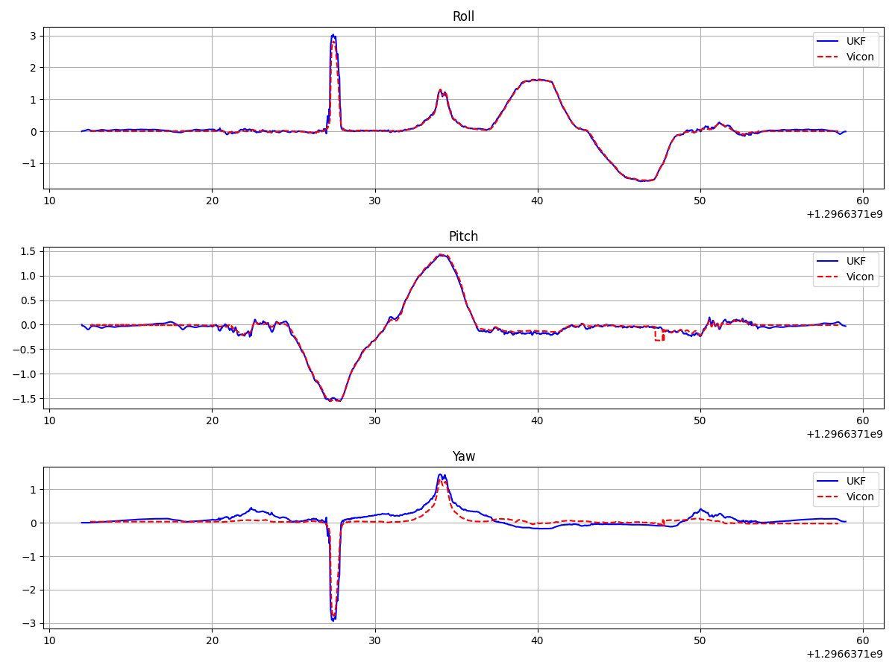

# IMU Sensor Calibration and Orientation Estimation

This repository implements sensor calibration and orientation estimation algorithms for IMU data. The UKF fuses accelerometer and gyroscope measurements to provide robust orientation estimates.

The implementation includes custom sensor calibration routines using Nelder-Mead and L-BFGS-B optimization techniques, achieving good accuracy when compared against Vicon ground truth data. The UKF successfully tracks roll and pitch angles with high fidelity, while maintaining reasonable yaw tracking despite the challenges of gyroscope drift. Key files include ukf.py, utils.py, and main.py, with dependencies on NumPy, SciPy, and Matplotlib.

The calibration results for different axes:
